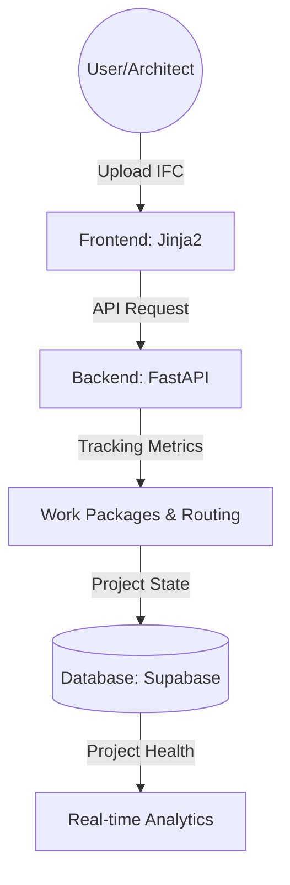

# 🏗️ Vinicius Project Command: 5D Infrastructure Management

**Vinicius Project Command** is a high-performance platform designed for modern infrastructure oversight. It integrates robust, OpenProject-inspired tracking with an advanced 5D project management suite, supporting direct IFC model alignments.

---

## 🛰️ System Design

---

## 🚀 Key Modules

### 1. **AI 3D Model Constructor (OCR Pipeline)**
Transforms scattered documents into spatial assets.
- **Multimodal OCR**: Simultaneously processes PDFs, JPEGs, and text specifications.
- **Spatial Reasoning**: Gemini 3.0 generates raw Wavefront OBJ code from unstructured floor plans.
- **Side-by-Side Verification**: Direct visual comparison between source blueprints and generated models.

### 2. **3D Architecture Lab**
Natural language to system visualization.
- **Semantic Mapping**: Concepts (e.g., "Cloud DB", "API Gateway") are mapped to 3D primitives.
- **Interactive Scenes**: Three.js-based viewer with real-time AI-assisted design updates.

### 3. **5D Project Command Suite**
Advanced project monitoring and financial oversight.
- **Work Packages**: Granular task management linked to physical BIM elements.
- **Financial Metrics**: Automated calculation of CPI (Cost Performance Index) and EAC (Estimate at Completion).
- **Multi-tier Governance**: Integrated approval workflow for Staff, Managers, and Directors.

---

## 🛠️ Technical Stack

- **Backend**: Python 3.10+, FastAPI, SQLModel.
- **Frontend**: Vanilla JS, Three.js, Cannon.js (Physics), CSS Glassmorphism.
- **AI**: Google Gemini Pro & Flash (Multimodal).
- **Infrastructure**: Uvicorn ASGI, SQLite (Local Data).

---

## 📂 Project Structure

- `backend/app/`: Core logic, models, and API routes.
- `backend/app/services/`: AI engines (Architecture, Plan, Cost).
- `templates/`: Jinja2 HTML templates.
- `static/`: 3D models, uploaded documents, and CSS.
- `PROJECT_DOCUMENTATION.md`: Detailed technical deep-dive.

---

## 🚦 Quick Start (Local)

1. **Install**: `pip install -r requirements.txt`
2. **Configure**: Copy `.env.example` to `.env` and fill in Supabase + Gemini credentials.
3. **Run**: `uvicorn backend.app.main:app --reload --port 8000`
4. **Access**: [http://localhost:8000](http://localhost:8000)

---

## ☁️ Deploy to Render

1. Push your repo to GitHub.
2. Create a new **Web Service** on [Render](https://render.com).
3. Connect your GitHub repository — Render will detect the `render.yaml` Blueprint.
4. Set the following environment variables in the Render dashboard:
   - `SECRET_KEY` (auto-generated)
   - `SUPABASE_URL`
   - `SUPABASE_ANON_KEY`
   - `SUPABASE_SERVICE_ROLE_KEY`
   - `GEMINI_API_KEY`
5. Deploy — the service will start with Gunicorn + Uvicorn workers.
